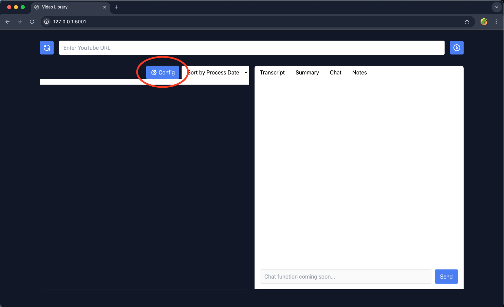
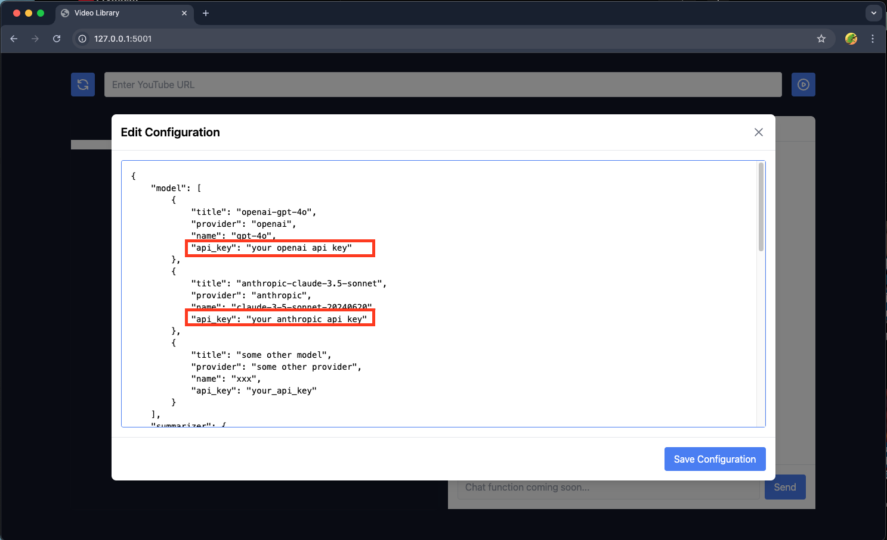

# YouTube Channel Monitor (Pre-release)

This tool monitors selected YouTube channels and generates summary reports of the latest videos. The key benefit is helping you decide whether to watch videos by reading AI-generated summaries first, saving you valuable time.

While there are similar products available (often paid), this solution offers unique values:
- It provides a daily report of concise summaries of channels' latest update that can replace watching entire videos in many cases. 
- It can get transcript for videos that does not have a subtitle, e.g. videos in Chinese. If you want to read the summary of a video in Chinese, this is the app you are looking for.

The application includes a web-based user interface. **Email notification functionality is currently under development**. For now, videos of interest must be manually added to the database.

## Latest update
- 1.1.0 Video processing is now asynchronous. You can add as many videos to the queue all at once.
- 1.0.4 User can modify configurations using UI pop up window.


## Usage
#### Installation
Installation is easy, just open terminal and type:
```bash
pip install video-curator
```
Then type the following command to run (it is `yourtube`, with an 'r'):
```bash
yourtube
```
This will open a web app in your default browser. For each video the app will fetch subtitles, summarize the content and store it in a sql database. 

#### Configure
If you are using this app for the first time, you need to modify the config file and add openai or anthropic api keys.





What configuration you can customize in `config.json` file:
```json
{
    "model": [ // The models possibly used in this app
        {
            "title": "openai-gpt-4o",
            "provider": "openai",
            "name": "gpt-4o",
            "api_key": "YOUR_OPENAI_API_KEY" // Api KEY
        },
        {   
            "title": "anthropic-claude-3.5-sonnet",
            "provider": "anthropic",
            "name": "claude-3-5-sonnet-20240620",
            "api_key": "YOUR_ANTHROPIC_API_KEY"
        }
    ],
    "transcriber": {
        "model": "whisper",
        "size": "small", // model size. See: https://github.com/openai/whisper
        "temperature": 0
    },
    "summarizer": {
        "model_title": "openai-gpt-4o", // the model title defined above, openai is used by default
        "max_tokens": 4096,
        "temperature": 0.8
    },
}
```

#### Here is a demo
<a href="https://youtu.be/wu59USebe3g">
  
</a>

## Developer

If you want to have more control on the installation and would like to play around with the code, please to to developer mode: 

1. Clone this repository:
```bash
git clone https://github.com/zleung9/youtube-transcribe.git
cd youtube-transcribe
```

2. Activate a Python environment using conda or venv:

   **Using conda:**
   ```bash
   conda create -n youtube-transcribe python=3.10
   conda activate youtube-transcribe
   ```

   **Using venv:**
   ```bash
   python -m venv .venv
   # On Windows
   .venv\Scripts\activate
   # On macOS/Linux
   source .venv/bin/activate
   ```


3. Install the required packages. 
```bash
pip install -e . -r requirements.txt
```

4. Set up configuration as described in previous section. You do need to initiate a configuration file to begin with.
```bash
cp config.json.template config.json
```


The configuration file supports multiple AI models for summarization, YouTube channel monitoring with customizable check intervals, and email notification settings. You'll need to provide your own API keys for the services you plan to use.

5. Run in command line

Run the main script. The command is `yourtube` with an "r". 
```bash
yourtube
```

